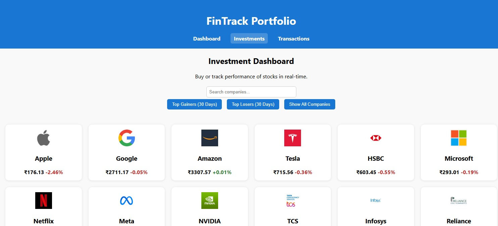
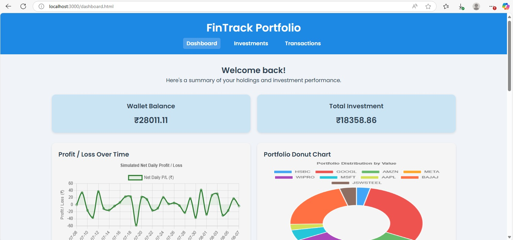

# 💼 Portfolio Dashboard Web Application

This is a full-stack web application designed to help users manage their financial portfolio, track wallet balances, and view or record transaction histories through a clean and interactive dashboard.

---

## 🌐 About the Application

This application simulates a simplified version of a portfolio tracker — similar to what users might use to monitor their crypto or stock investments. It offers:

- A user-friendly **dashboard interface**
- Real-time display of **wallet balance**, **portfolio performance**, and **transaction history**
- Options to **record buy/sell operations**
- A structured **MySQL database** to maintain user data integrity

---

## 📋 Prerequisites

Before running this project, ensure you have the following installed:

- **Node.js** (for the frontend, if applicable)
- **Python 3.8+** (if the backend uses FastAPI or Flask)
- **MySQL Server** (locally or remotely hosted)
- **Git** (to clone the repository)
- A code editor like **VS Code**

---

## 🚀 How to Run the Application (Basic Steps)

1. **Clone the repository**

2. **Set up environment variables**
- Create a `.env` file.
- Add database credentials and API keys if required.

3. **Set up the database**
- Run the SQL schema to create necessary tables.
- Use any MySQL GUI tool (like phpMyAdmin or MySQL Workbench) or terminal.

4. **Start the backend server**
- Run your API service (e.g., with `uvicorn` for FastAPI or `flask run`).

5. **Start the frontend**
- Navigate to the frontend directory and run the dev server (`npm run dev`).

6. **Visit the Dashboard**
- Open your browser and go to `http://localhost:3000` (or the appropriate port).

---

## 📂 Key Components

| Component     | Description                                           |
|---------------|-------------------------------------------------------|
| **User Interface** | Dashboard showing portfolio data and options to transact |
| **Backend API**    | Validates inputs, updates database, handles logic     |
| **MySQL Database** | Stores persistent data for users, transactions, etc.  |

---

Feel free to fork, clone, and build on top of it!

